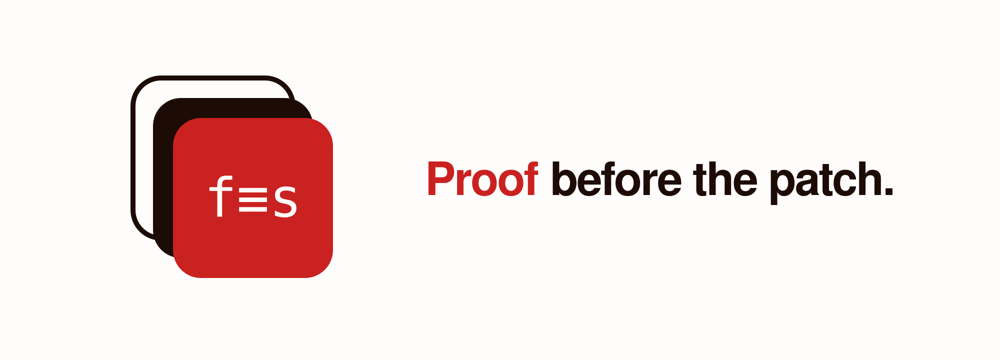

# formal-spec

<p align="center">
  
</p>

## Give important behavior a contract — not just a prompt

`formal-spec` is proof-first behavior development for coding agents. It turns a
product request into an independent formal specification, connects it to a
program model through checked obligations, and uses the resulting proofs to
guide implementation checks.

The result compounds. Future changes must preserve the invariants that matter
or deliberately revise them — not silently drift past them. When a proof
breaks, the failure creates a review question: did intent change, did the model
change, did the implementation regress, or did an assumption surface?

## Install

Install the `formal-spec` skill from its public GitHub repository:

```sh
npx skills add seqra/formal-spec
```

After installation, compatible coding agents can apply the skill in context
when a task contains a meaningful behavior claim. To steer a task, say:
“Work proof-first on this change.” No special syntax is required.

## See proof-first behavior in action — [inventory storyboard](demo/README.md)

<p align="center">
  <a href="assets/demo.mp4"></a>
</p>

The animation follows one product rule: `reserved ≤ stock`.
Ordinary tests stay green, then the proof-derived case `stock = 5, reserved = 4, ship = 2` exposes a shipment that leaves three units for four reserved orders.
A corrected guard preserves the invariant across all 126 cases in the declared finite model.

## The controlled proof-first loop

```text
source → justified translation → Lean model
independent spec + Lean model → generated obligations → user proofs
translation soundness + user proofs → source-semantic theorem
model-derived tests → separate runtime evidence
```

- **Intent** states behavior, boundaries, assumptions, and exclusions.
- **Formal spec** records what the product must preserve independently of the
  current implementation.
- **Model** captures only the relevant behavior, and only when needed.
- **Obligations and proofs** check that the model satisfies the specification.
- **Translation soundness** lets the final theorem concern formal source
  semantics when the frontend boundary is justified.
- **Tests** compare executable behavior with the proved target on declared
  cases.
- **Feedback** returns failures to the earliest false layer instead of
  weakening the contract to make a build green.

Runtime tests are exhaustive only when the implementation domain is finite and
every case is executed. For an infinite domain, the symbolic proof covers the
model and supplies a finite set of guards, boundaries, transitions, and
counterexamples to test against the implementation. Neither covers behavior
omitted from the specification or makes the whole system bug-free.

AI lowers the cost of the mechanical work — predicates, boundary cases, models,
proof scaffolding, finite test vectors, and readable descriptions. People still
choose the intent and judge whether the model represents the product.

## Why this is becoming practical

On September 8, 2026, [OpenAI shared what it describes as a solution to the
Navier–Stokes problem](https://openai.com/index/navier-stokes-solution/),
including a Lean formalization. It reports 88 hours to reach the resolution and
an additional 17 hours for Lean formalization and verification, while explicitly
saying it does not intend to claim the Millennium Prize. This is a shared,
claimed result — not Clay acceptance. The narrower lesson for software is that
AI is making formal authoring and proof repair practical inside ordinary work.

## What remains checked and human

A model proof alone does not establish that production source matches the
model. A checked translation theorem can establish that relationship for its
defined source semantics; exact source bytes and deployed executables require
additional justified frontend and runtime boundaries. Otherwise, reviewed
conformance tests provide finite implementation evidence. `LibSpec`, a small
reusable library for relation and transition proofs, ships with the skill.

## Learn more

- [Skill instructions](skill/SKILL.md)
- [Controlled development loop](skill/references/workflow.md)
- [Source-level architecture and checked example](skill/references/verification-architecture.md)
- [Model-derived testing](skill/references/testing.md)
- [Readable specifications](skill/references/descriptions.md)
- [LibSpec](skill/LibSpec/)

Apache-2.0. See [LICENSE](LICENSE).
